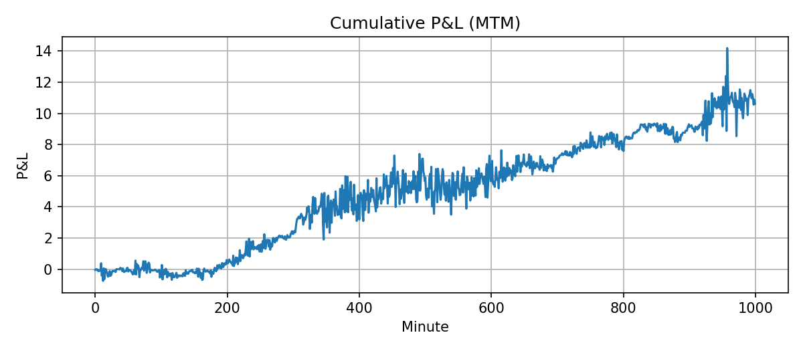
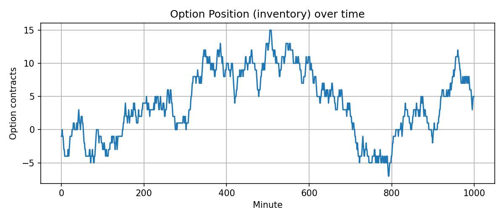
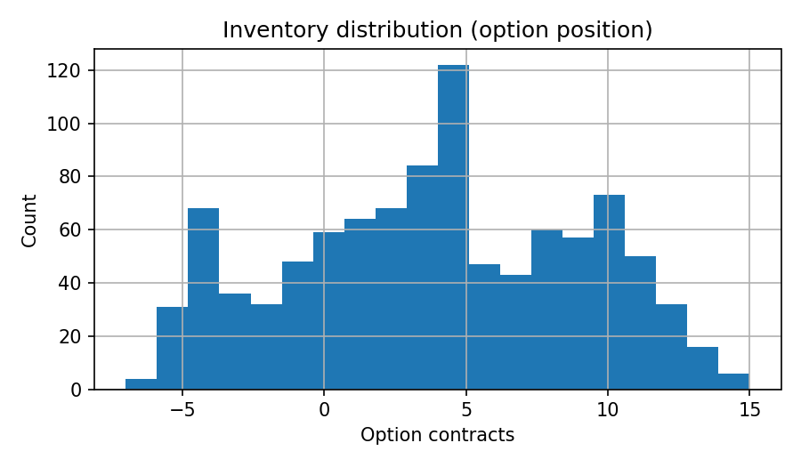
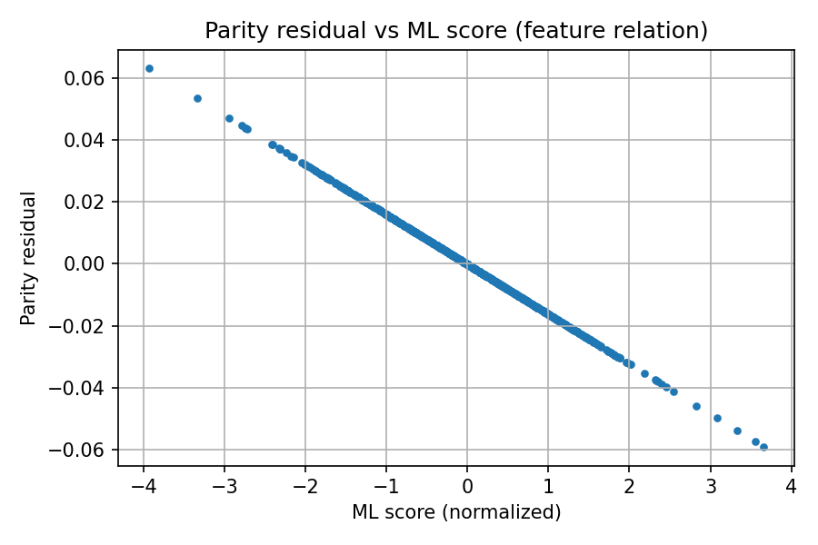

# opt_mm_sim — Delta-Neutral Options Market-Making Simulator

**What this does:** simulates a small options market-making loop on minute data:
- compute **Black-Scholes** theos and **delta**
- compute a **put–call parity residual** (sanity/feature)
- build **bid/ask** around mid; **skew** quotes using a short-horizon feature
- simulate **fills** with a tunable probability model
- **delta-hedge immediately** with the underlying
- track **P&L**, **inventory**, and diagnostics; save plots to `reports/`

A **CSV path** is available for a single option series (strike+expiry) in addition to the **synthetic demo**.

---

## Setup

python3 -m venv .venv
source .venv/bin/activate # Windows: ..venv\Scripts\Activate.ps1
pip install --upgrade pip
pip install -r requirements.txt

yaml
Copy code

Run tests:

pytest -q

yaml
Copy code

---

## Synthetic demo (reproducible)

Command used for the latest run:

python src/engine/backtest_engine.py --demo --n 1000 --skew 0.02 --k-fill 40

pgsql
Copy code

Summary printed by the script (synthetic):

{
"net_pnl": 10.6088,
"annualized_sharpe_est": 5.0143,
"total_fills": 755,
"avg_inventory": 5.218
}

markdown
Copy code

**Figures saved to `reports/`:**
- `fig_pnl.png` — cumulative MTM **P&L**
- `fig_inventory.png` — option **inventory over time**
- `fig_inventory_hist.png` — **inventory distribution**
- `fig_parity_vs_ml.png` — **parity residual** vs feature score

### Figures

**Cumulative P&L**  

**Inventory over time**  

**Inventory distribution**  

**Parity residual vs ML score**  

> Note: this is a toy loop. No fees/slippage/latency or contract multiplier yet, so Sharpe is optimistic.

---

## Run with a CSV sample (real-data friendly)

Use `backtest_from_csv.py` to run on a simple CSV containing a *single* strike/expiry across time.

Example:

python src/engine/backtest_from_csv.py --csv data/sample_calls.csv --skew 0.02 --k-fill 8

markdown
Copy code

**CSV columns (case-insensitive):**  
required — `underlying`/`S`, `strike`/`K`, and either `call_mid` *or* both `call_bid` & `call_ask`  
one of — `expiry` (YYYY-MM-DD) / `time_to_expiry_days` / `T_years`  
optional — `timestamp`, `put_mid`, `r`, `iv`, `dividend_yield` (`q`), `pv_div`, `spread`

The loader converts this into engine columns:  
`minute, underlying, mid, spread, T_years, theo_delta, parity_residual, ml_score`.

**Tip:** for very short CSVs, lower `--k-fill` to get more simulated fills.

---

## What lives where

src/
engine/
backtest_engine.py # synthetic builder + engine (saves plots)
backtest_from_csv.py # CSV runner (reuses the engine)
io/
csv_loader.py # flexible CSV → engine DataFrame
theory/
parity.py # put–call parity helpers
tests/
conftest.py # adds project root to PYTHONPATH for pytest
test_parity.py # parity residual unit test
reports/ # output figures (PNG)
data/ # your CSV samples (keep small in git)

markdown
Copy code

---

## Next work

- add **contract multiplier (100)**, option & hedge **costs**, **discrete hedge** cadence  
- calibrate **fill model**; add **risk caps**  
- train a small model (e.g., **LightGBM**) to replace the toy feature  
- extend CSV path to **multiple strikes/expiries**  
- **Streamlit** page to explore runs
